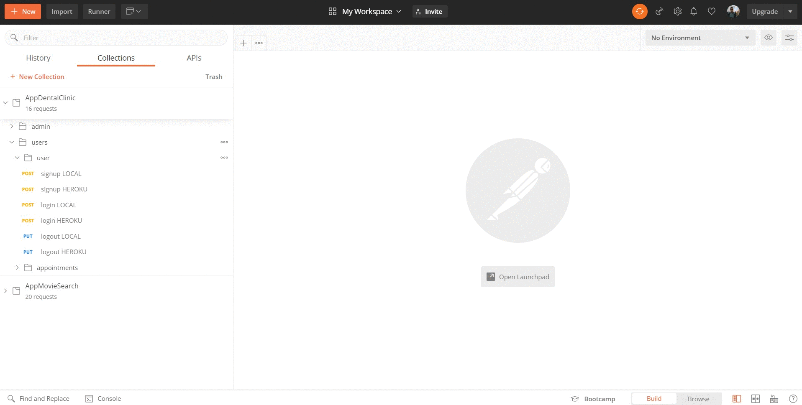
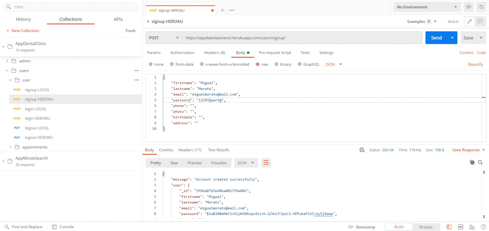
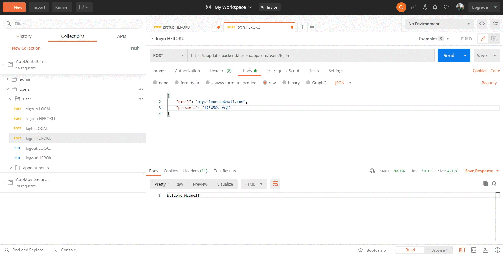
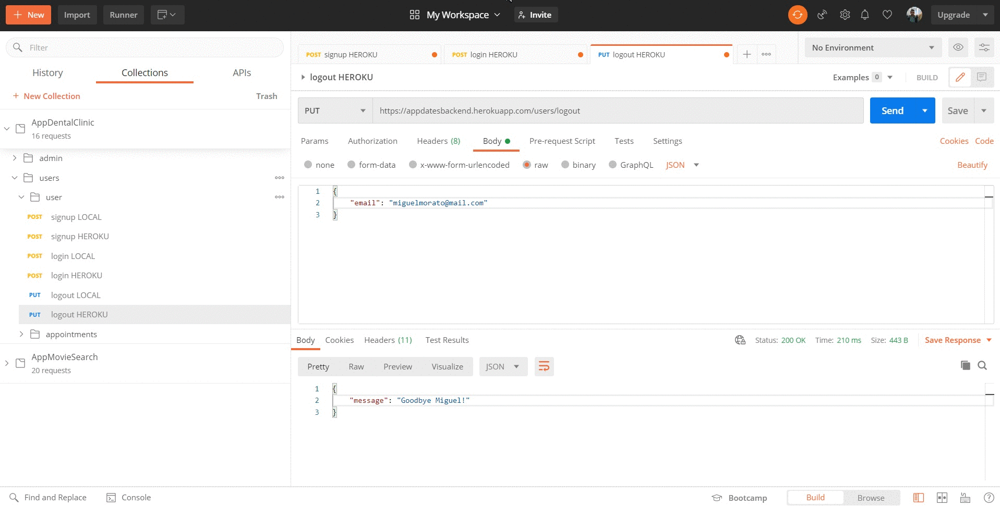
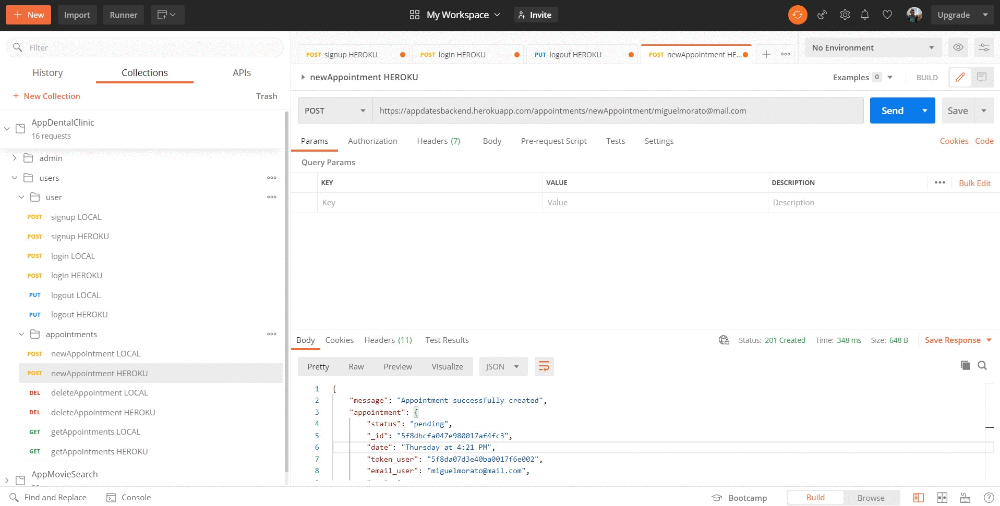
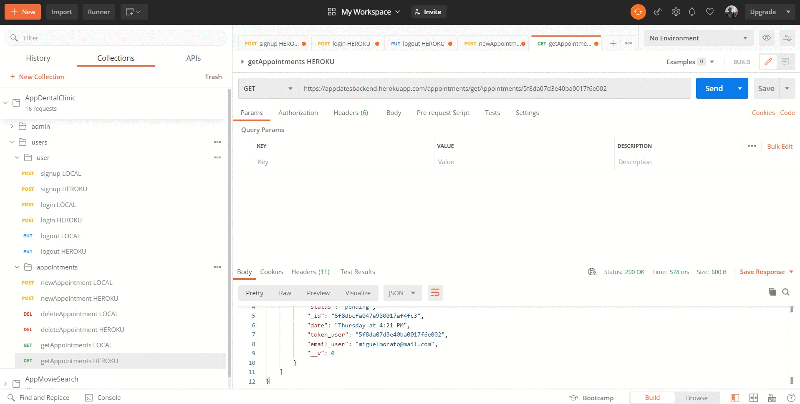

---
# appDates 🦷
## What is appDates? 🤔
appDates is an application to manage the appointments that a user has. In this case, it is about appointments for a dental clinic.
> Note: This repository is the backend of the application.
---
## Technologies used 🛠️
- JavaScript
- NodeJS 
- Express
- MongoDb
- Mongoose
- Mongo Atlas
- Bcryptjs
- Postman
- Github
- Gitflow
- RegEx
- Moment
- Heroku
---
## Necessary dependencies 📋
- bcryptjs
- express
- mongoose
- moment
---
## Steps to run the application 🚀
> - Download the [repository](https://github.com/Cheroki84/appDates.git)
>- Initialize npm and install the necessary dependencies:
>   - $ npm init -y
>   - $ npm i
>- Run the app:
>   - $ npm run start

> Note: The application is uploaded to [Heroku](https://appdatesbackend.herokuapp.com)
---
## Some working samples ⚙️
### User management 
#### signup

- The email and password have established requirements with **RegEx**. 
- If there is already an account registered with that email, notify the user to choose a different one.
- The password must have the following characteristics:
    - Between 8 and 16 characters
    - At least 1 number
    - At least 1 lowercase letter
    - At least 1 uppercase letters
    - At least 1 special character`
---
#### login

- If you enter a wrong email or password, the app launches a warning message.
- When the user registers, a token is generated.
---
#### logout

- When the user logs out, the token is removed.
---

### Appointment management
#### newAppointment

- After logging in again, the user can request the appointment.
    - The appointment is generated automatically thanks to the use of **moment**.
---
#### getAppointments

- The token_user of the appointments is the _id of the user. This is the same for all appointments of said user, thus allowing them to be displayed, as long as the user is logged in.

---
#### deleteAppointment

- However, to delete an appointment we pass the _id of the appointment, so that it will only be deleted.

---

## All endpoints /

### Endpoints of Admin
- GET all users
    - /admin/allUsers
###
- GET all appointments
    - /admin/allAppointments/
###

### Endpoints of Users
- POST sign up
    - /users/signup/
###
- POST login
    - /users/login
###
- PUT logout
    - /users/logout
###

### Endpoints of Appointments
- GET appointments
    - /appointments/getAppointments/<<<user's token>>>
####
- POST new appointment
    - /appointments/newAppointment/>>>user's email<<<
####
- DELETE appointment
    - /appointments/deleteAppointment/<<<appointment's id>>>

---

> Note: The admin endpoint is for sample only, it has no security among other things.

---

