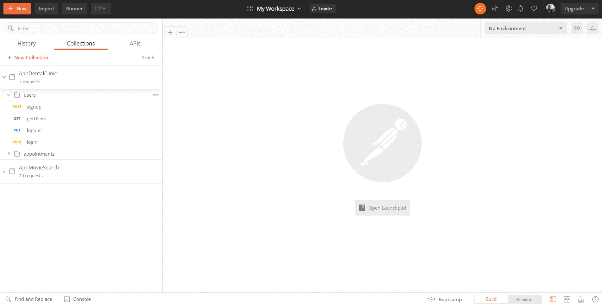
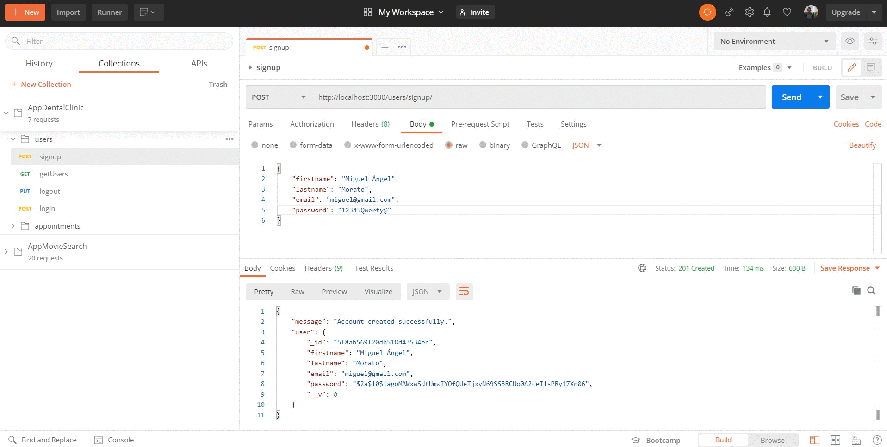
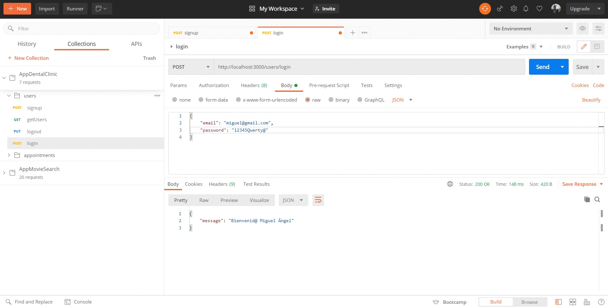
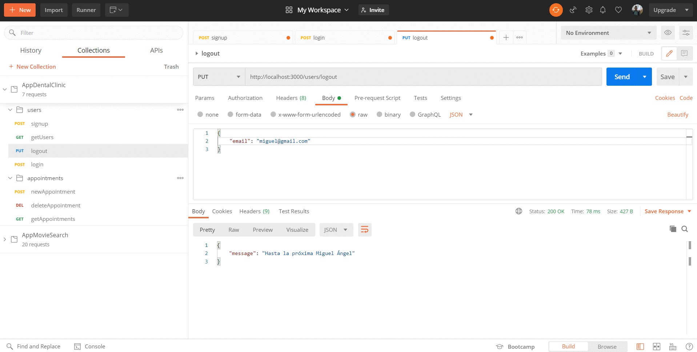
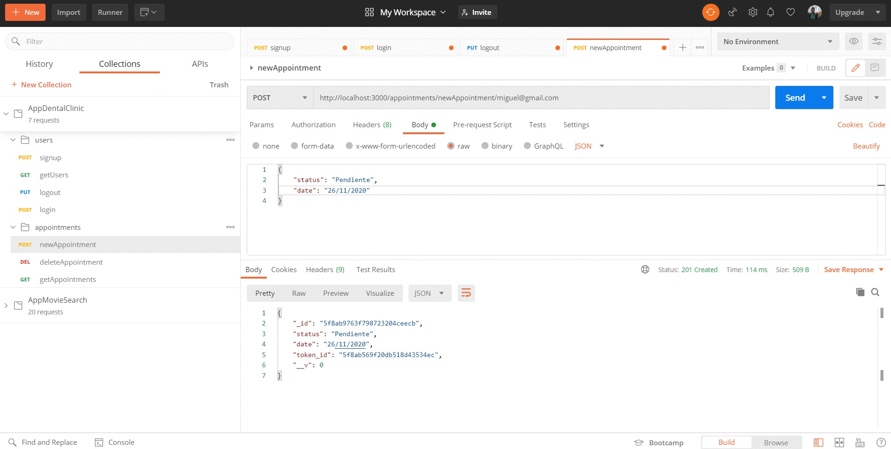
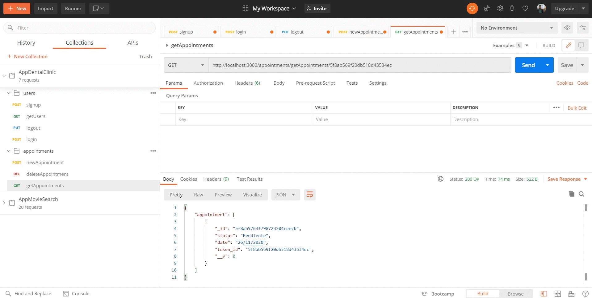

# appDates
## What is appDates? 🤔
appDates is an application to manage the appointments that a user has. In this case, it is about appointments for a dental clinic.
> Note: This repository is the backend of the application.

## Technologies used 🛠️
- JavaScript
- NodeJS 
- Express
- MongoDb
- Mongoose
- Mongo Atlas
- Bcryptjs
- Postman
- Github
- Gitflow
- RegEx
- Moment
- Heroku

## Necessary dependencies 📋
- bcryptjs
- express
- mongoose
- moment

## Steps to run the application 🚀
> - Download the [repository](https://github.com/Cheroki84/appDates.git)
>- Initialize npm and install the necessary dependencies:
>   - $ npm i
>- Run the app:
>   - $ npm run start

> Note: The application is uploaded to [Heroku](https://appdatesbackend.herokuapp.com)

## Some working samples ⚙️
#### User management 
- signup

###
- login

###
- logout

#### Appointment management
- newAppointment

###
- getAppointments

###
- deleteAppointment

## All endpoints ⚫

### Endpoints of Admin
- GET all users
    - /admin/allUsers
###
- GET all appointments
    - /admin/allAppointments/
###

### Endpoints of Users
- POST sign up
    - /users/signup/
###
- POST login
    - /users/login
###
- PUT logout
    - /users/logout
###

### Endpoints of Appointments
- GET appointments
    - /appointments/getAppointments/<<<user's token>>>
####
- POST new appointment
    - /appointments/newAppointment/>>>user's email<<<
####
- DELETE appointment
    - /appointments/deleteAppointment/<<<appointment's id>>>